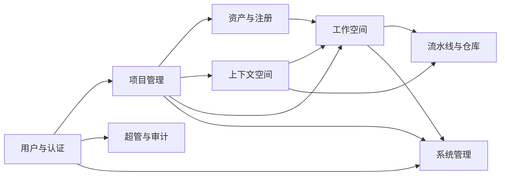

# DDL 上下文文档 — qa-live-healthcare 数据库

## 1. 数据库概览

| 属性 | 值 |
|------|-----|
| 数据库类型 | MySQL 8.x（InnoDB 引擎，utf8mb4_unicode_ci 排序规则） |
| 表总数 | 36 |
| 显式外键数 | 6 |
| 业务领域 | 8 |

### 数据库引擎与字符集

- 全部表使用 InnoDB 引擎
- 默认字符集：utf8mb4，排序规则：utf8mb4_unicode_ci（少数表使用 utf8mb4_0900_ai_ci）
- 部分表启用 ROW_FORMAT=DYNAMIC

---

## 2. 实体关系图

```mermaid
erDiagram
    users {
        bigint_unsigned id PK "主键"
        varchar_email UK "唯一邮箱"
        varchar_password "密码哈希"
        varchar_first_name "名"
        varchar_last_name "姓"
        varchar_username "展示姓名"
        tinyint_status "1-活跃 0-停用 2-锁定"
        varchar_register_source "注册来源"
        tinyint_login_page_allowed "是否允许密码登录"
    }

    bank_users {
        bigint_unsigned id PK "主键"
        varchar_iam_login_no UK "IAM登录号"
        varchar_email UK "邮箱"
        varchar_username "姓名"
        varchar_status "状态"
    }

    user_mappings {
        bigint_unsigned id PK
        bigint_unsigned user_id UK "FK users"
        bigint_unsigned bank_user_id UK "FK bank_users"
        varchar_mapping_status "BOUND"
    }

    personal_access_tokens {
        bigint_unsigned id PK
        bigint_unsigned user_id FK "FK users"
        varchar_name "令牌名称"
        varchar_token_hash "令牌哈希"
        datetime_expires_at "过期时间"
        datetime_revoked_at "撤销时间"
    }

    password_crypto_key {
        bigint id PK
        varchar_key_version UK "密钥版本"
        longtext_public_key_pem "公钥PEM"
        longtext_private_key_ciphertext "私钥密文"
        tinyint_is_active "是否激活"
    }

    roles {
        bigint_unsigned id PK
        varchar_name UK "角色标识"
        varchar_display_name "显示名"
        varchar_status "状态"
    }

    user_rule_mappings {
        bigint_unsigned id PK
        bigint_unsigned user_id "FK users"
        varchar_collection_id "集合ID或*"
        varchar_project_id "项目ID或*"
        bigint_unsigned rule_id "FK roles"
        varchar_rule_name "角色标识"
    }

    project_collections {
        int_unsigned id PK
        char_guid UK "稳定GUID"
        varchar_collection_uid UK "路由UID"
        varchar_name "集合名"
        varchar_status "active/inactive"
    }

    projects {
        bigint id PK
        char_guid UK "UUID"
        varchar_project_uid UK "项目slug"
        bigint_collection_id "FK project_collections"
        varchar_name "项目名"
        varchar_status "Active/Pending/Completed"
        date_start_date "开始日期"
        date_end_date "结束日期"
    }

    project_repositories {
        bigint id PK
        bigint_project_id "FK projects"
        varchar_repository_source_type "gitlab/github/custom"
        varchar_base_url "仓库源URL"
        varchar_token "访问Token"
        varchar_repository_name "仓库路径"
        varchar_default_branch "默认分支"
        varchar_status "Active/Deactive"
    }

    asset_collections {
        bigint_unsigned id PK
        bigint_repository_id "仓库ID"
        varchar_collection_uid "路由UID"
        varchar_project_uid "项目UID"
        varchar_status "active/inactive"
    }

    asset_registry_info {
        bigint id PK
        varchar_registry_level "server/project"
        varchar_registry_id "注册ID"
        varchar_config_type "toolset/spec/mcp/skill"
        varchar_affiliated_organization "所属组织"
        varchar_affiliated_project "所属项目"
        varchar_guid "全局唯一标识"
        varchar_name "注册名称"
        varchar_version "版本"
        varchar_download_url "下载地址"
        tinyint_is_share "是否共享"
    }

    asset_command_scenario {
        bigint id PK
        varchar_config_type "配置类型"
        bigint_registry_id "FK asset_registry_info"
        varchar_command "命令标识"
        varchar_scenario "场景描述"
        text_md_content "Markdown内容"
    }

    asset_repositories {
        bigint id PK
        varchar_asset_level "org/project"
        varchar_config_type "toolset_repo/spec_repo"
        varchar_repository_source_type "gitlab/github"
        varchar_base_url "仓库源URL"
        varchar_token "访问Token"
        varchar_repository_name "仓库名称"
        varchar_status "Active/Deactive"
    }

    library_contexts {
        bigint id PK
        char_guid UK "上下文空间GUID"
        varchar_name "空间名称"
        bigint_collection_id "FK project_collections"
        bigint_project_id "FK projects"
        bigint_owner_id "FK users"
        varchar_status "Active/Archived"
        tinyint_auto_sync_enabled "自动同步"
        bigint_project_repository_id "FK project_repositories"
    }

    library_context_items {
        bigint id PK
        char_guid UK "条目GUID"
        bigint_context_id "FK library_contexts"
        varchar_name "条目名称"
        varchar_type "条目类型(codebase等)"
        varchar_uri "仓库URL"
        varchar_branch "分支名"
        bigint_project_repository_id "FK project_repositories"
        varchar_status "Active/Deactive"
        varchar_sync_status "同步状态"
    }

    library_context_item_file_uploads {
        bigint id PK
        char_guid UK "记录GUID"
        bigint_context_id "FK library_contexts"
        bigint_context_item_id "FK library_context_items"
        varchar_original_filename "原始文件名"
        varchar_stored_filename "存储文件名"
        char_md5 "文件MD5"
        tinyint_is_archive "是否归档"
        varchar_content_type "Content-Type"
        bigint_file_size_bytes "文件大小"
    }

    library_context_item_file_upload_entries {
        bigint id PK
        bigint_upload_id "FK library_context_item_file_uploads"
        varchar_relative_path "相对路径"
        varchar_file_name "文件名"
        varchar_public_uri "访问URI"
        bigint_file_size_bytes "文件大小"
        char_md5 "文件MD5"
    }

    library_context_sync_history {
        bigint id PK
        char_guid UK "同步记录GUID"
        bigint_context_id "FK library_contexts"
        bigint_context_item_id "FK library_context_items"
        varchar_repo_name "仓库名"
        varchar_repo_url "仓库URL"
        varchar_branch "分支名"
        bigint_run_id "GitHub Actions runId"
        bigint_server_id "FK global_repositories"
        varchar_workflow_status "queued/in_progress/completed"
        varchar_status "Success/Failed"
    }

    library_context_results {
        bigint id PK
        char_guid UK "结果GUID"
        bigint_context_id "FK library_contexts"
        bigint_context_item_id "FK library_context_items"
        bigint_sync_history_id "FK library_context_sync_history"
        varchar_artifact_name "artifact名称"
        varchar_file_name "文件名"
        longtext_file_content "文件内容"
    }

    workspaces {
        bigint id PK
        char_guid UK "工作空间GUID"
        varchar_name "空间名称"
        bigint_collection_id "FK project_collections"
        bigint_project_id "FK projects"
        bigint_owner_id "FK users"
        varchar_type "CODE/NORMAL"
        bigint_project_repository_id FK "FK project_repositories"
        varchar_status "Active/Archived"
    }

    workspace_relations {
        bigint_workspace_id PK "FK workspaces"
        varchar_kind PK "toolset/context/spec"
        varchar_ref_id PK "关联ID"
    }

    workspace_resource_links {
        bigint id PK
        bigint_workspace_id FK "FK workspaces"
        varchar_resource_kind "CONTEXT/TOOLSET/SPEC"
        bigint_library_context_id FK "FK library_contexts"
        varchar_resource_id "资源ID快照"
        varchar_resource_guid "资源GUID快照"
        varchar_resource_name "资源名称快照"
    }

    workspace_run_history {
        bigint id PK
        varchar_guid UK "运行记录GUID"
        varchar_workspace_id "工作空间ID"
        text_prompt_text "提示文本"
        varchar_repo_url "仓库URL"
        varchar_branch "分支"
        bigint_run_id "流水线runId"
        varchar_workflow_status "工作流状态"
        varchar_status "业务状态"
        bigint_server_id "FK pipeline_servers"
    }

    workspace_artifacts {
        bigint id PK
        char_guid UK "制品GUID"
        bigint_workspace_id FK "FK workspaces"
        bigint_run_history_id FK "FK workspace_run_history"
        varchar_storage_name "存储名称"
        varchar_artifact_type "output/log/report/archive/other"
        varchar_status "Active/Archived/Deleted"
    }

    global_repositories {
        bigint id PK
        varchar_name "展示名称"
        varchar_uname UK "唯一标识"
        varchar_setting_type "server/pipeline"
        varchar_pipeline_type "流水线二级类型"
        varchar_server_type "服务端二级类型(github/jenkins)"
        varchar_repository_source_type "gitlab/github/custom"
        varchar_base_url "仓库源URL"
        varchar_token "访问Token"
        varchar_repository_name "仓库路径"
        varchar_status "Active/Deactive/Removed"
    }

    pipeline_servers {
        bigint id PK
        varchar_name "服务名"
        varchar_uname UK "唯一标识"
        varchar_server_type "github/jenkins"
        varchar_repository_source_type "github"
        varchar_base_url "仓库URL"
        varchar_token "访问Token"
        varchar_repository_name "仓库名称"
        varchar_status "Active/Deactive"
    }

    config_settings {
        int_unsigned id PK
        char_guid UK "稳定GUID"
        varchar_uname UK "唯一标识"
        varchar_level "server/collection/project/user"
        int_unsigned_collection_id "FK project_collections"
        int_unsigned_project_id "FK projects"
        int_unsigned_user_id "FK users"
        json_value "配置键值"
        varchar_operator_scope "all-admin/whitelist-admin"
    }

    feature_flags {
        bigint_unsigned id PK
        varchar_flag_key UK "开关唯一标识"
        varchar_flag_value "开关值(true/false)"
        varchar_description "开关说明"
    }

    reporting_events {
        bigint id PK
        varchar_event "事件名称"
        varchar_batch_id "批次标识"
        int_event_count "事件数量"
        text_events "事件明细JSON"
        varchar_active_workspace_id "工作空间ID"
        datetime_event_timestamp "接收时间"
    }

    super_admin_operation_audit_logs {
        bigint_unsigned id PK
        varchar_operation_type "操作类型"
        bigint_unsigned_operator_user_id "操作人ID"
        bigint_unsigned_target_user_id "目标用户ID"
        json_request_payload "请求负载"
        varchar_result_status "SUCCESS/FAILED/REJECTED"
        varchar_error_code "错误码"
        varchar_client_ip "客户端IP"
    }

    super_admin_operator_whitelist {
        bigint_unsigned id PK
        bigint_unsigned_operator_user_id UK "授权操作人ID"
        varchar_status "active/inactive"
        varchar_remark "备注"
    }

    org_create_quota_rules {
        bigint_unsigned id PK
        varchar_subject_type "USER_TYPE"
        varchar_subject_key "SUPER_ADMIN/NON_SUPER_ADMIN"
        int_quota_limit "配额限制(-1无限)"
    }

    org_create_usage {
        bigint_unsigned id PK
        bigint_unsigned_user_id UK "FK users"
        int_used_count "已创建数量"
        bigint_unsigned_last_collection_id "最近创建集合ID"
    }

    flyway_schema_history {
        int_installed_rank PK
        varchar_version "版本"
        varchar_description "描述"
        varchar_type "类型"
        varchar_script "脚本"
        tinyint_success "是否成功"
    }

    one_time_task_control {
        bigint id PK
        varchar_task_code UK "任务编码"
        varchar_task_name "任务名称"
        varchar_status "状态"
    }

    %% 显式外键关系
    personal_access_tokens }o--|| users : "user_id"
    user_mappings }o--|| users : "user_id"
    user_mappings }o--|| bank_users : "bank_user_id"
    user_rule_mappings }o--|| users : "user_id"
    user_rule_mappings }o--|| roles : "rule_id"
    projects }o--|| project_collections : "collection_id"
    project_repositories }o--|| projects : "project_id"
    config_settings }o--o| project_collections : "collection_id"
    config_settings }o--o| projects : "project_id"
    config_settings }o--o| users : "user_id"
    library_contexts }o--|| project_collections : "collection_id"
    library_contexts }o--|| projects : "project_id"
    library_contexts }o--|| users : "owner_id"
    library_contexts }o--o| project_repositories : "project_repository_id"
    library_context_items }o--|| library_contexts : "context_id"
    library_context_items }o--o| project_repositories : "project_repository_id"
    library_context_item_file_uploads }o--|| library_contexts : "context_id"
    library_context_item_file_uploads }o--|| library_context_items : "context_item_id"
    library_context_item_file_upload_entries }o--|| library_context_item_file_uploads : "upload_id"
    library_context_sync_history }o--|| library_contexts : "context_id"
    library_context_sync_history }o--|| library_context_items : "context_item_id"
    library_context_sync_history }o--o| global_repositories : "server_id"
    library_context_results }o--|| library_contexts : "context_id"
    library_context_results }o--|| library_context_items : "context_item_id"
    library_context_results }o--|| library_context_sync_history : "sync_history_id"
    workspaces }o--|| project_collections : "collection_id"
    workspaces }o--|| projects : "project_id"
    workspaces }o--|| users : "owner_id"
    workspaces }o--o| project_repositories : "project_repository_id"
    workspace_relations }o--|| workspaces : "workspace_id"
    workspace_resource_links }o--|| workspaces : "workspace_id"
    workspace_resource_links }o--o| library_contexts : "library_context_id"
    workspace_run_history }o--|| workspaces : "workspace_id"
    workspace_run_history }o--o| pipeline_servers : "server_id"
    workspace_artifacts }o--|| workspaces : "workspace_id"
    workspace_artifacts }o--o| workspace_run_history : "run_history_id"
    org_create_usage }o--|| users : "user_id"
    super_admin_operation_audit_logs }o--o| users : "operator_user_id"
    super_admin_operation_audit_logs }o--o| users : "target_user_id"
    super_admin_operator_whitelist }o--|| users : "operator_user_id"
    asset_command_scenario }o--|| asset_registry_info : "registry_id"
```

---

## 3. 实体定义

### 3.1 用户与认证领域

#### users — 系统用户表

| 列名 | 类型 | 约束 | 说明 |
|------|------|------|------|
| id | bigint unsigned | PK, AUTO_INCREMENT | 主键 |
| email | varchar(255) | NOT NULL, UK | 唯一邮箱（登录标识） |
| password | varchar(255) | NOT NULL | 密码哈希 |
| first_name | varchar(100) | | 名 |
| last_name | varchar(100) | | 姓 |
| username | varchar(255) | | 身份源展示姓名（可含中文） |
| status | tinyint | NOT NULL, DEFAULT 1 | 1-活跃 0-停用 2-锁定 |
| register_source | varchar(32) | NOT NULL, DEFAULT 'LOCAL' | LOCAL / ADMIN_PROVISIONED / BANK_SSO |
| login_page_allowed | tinyint(1) | NOT NULL, DEFAULT 1 | 是否允许登录页密码登录 |

**索引**: `uk_users_email(email)`

```typescript
interface User {
  id: number;
  email: string;
  password: string;
  firstName?: string;
  lastName?: string;
  username?: string;
  status: 1 | 0 | 2;
  registerSource: 'LOCAL' | 'ADMIN_PROVISIONED' | 'BANK_SSO';
  loginPageAllowed: boolean;
  createdAt: Date;
  updatedAt: Date;
}
```

#### bank_users — 银行用户表

| 列名 | 类型 | 约束 | 说明 |
|------|------|------|------|
| id | bigint unsigned | PK, AUTO_INCREMENT | 主键 |
| iam_login_no | varchar(128) | NOT NULL, UK | IAM 登录号 |
| email | varchar(255) | NOT NULL, UK | 邮箱 |
| username | varchar(100) | NOT NULL | 姓名（来自上游 data.name） |
| first_name | varchar(100) | | 名 |
| last_name | varchar(100) | | 姓 |
| status | varchar(32) | NOT NULL, DEFAULT 'ACTIVE' | 状态 |

**索引**: `uk_bank_users_iam_login_no`, `uk_bank_users_email`, `idx_bank_users_username`

```typescript
interface BankUser {
  id: number;
  iamLoginNo: string;
  email: string;
  username: string;
  firstName?: string;
  lastName?: string;
  status: string;
  createdAt: Date;
  updatedAt: Date;
}
```

#### user_mappings — 用户映射表

| 列名 | 类型 | 约束 | 说明 |
|------|------|------|------|
| id | bigint unsigned | PK, AUTO_INCREMENT | 主键 |
| user_id | bigint unsigned | NOT NULL, UK | FK users.id |
| bank_user_id | bigint unsigned | NOT NULL, UK | FK bank_users.id |
| mapping_status | varchar(16) | NOT NULL, DEFAULT 'BOUND' | 绑定状态 |

```typescript
interface UserMapping {
  id: number;
  userId: number;
  bankUserId: number;
  mappingStatus: 'BOUND' | string;
  createdAt: Date;
  updatedAt: Date;
}
```

#### personal_access_tokens — 个人访问令牌表

| 列名 | 类型 | 约束 | 说明 |
|------|------|------|------|
| id | bigint unsigned | PK, AUTO_INCREMENT | 主键 |
| user_id | bigint unsigned | NOT NULL, FK→users.id | 所属用户 |
| name | varchar(64) | NOT NULL | 令牌名称 |
| token_prefix | varchar(16) | NOT NULL | 令牌前缀 |
| token_hash | varchar(255) | NOT NULL | 令牌哈希 |
| hash_algo | varchar(16) | NOT NULL, DEFAULT 'BCRYPT' | 哈希算法 |
| expires_at | datetime | NOT NULL | 过期时间 |
| revoked_at | datetime | | 撤销时间 |
| rotated_at | datetime | | 轮换时间 |

**外键**: `fk_pat_user(user_id) → users(id)`

```typescript
interface PersonalAccessToken {
  id: number;
  userId: number;
  name: string;
  tokenPrefix: string;
  tokenHash: string;
  hashAlgo: 'BCRYPT' | string;
  expiresAt: Date;
  revokedAt?: Date;
  rotatedAt?: Date;
  createdAt: Date;
  updatedAt: Date;
}
```

#### password_crypto_key — 密码加密密钥表

| 列名 | 类型 | 约束 | 说明 |
|------|------|------|------|
| id | bigint | PK, AUTO_INCREMENT | 主键 |
| key_version | varchar(32) | NOT NULL, UK | 密钥版本 |
| public_key_pem | longtext | NOT NULL | 公钥 PEM |
| private_key_ciphertext | longtext | NOT NULL | 私钥密文 |
| key_encrypt_alg | varchar(32) | NOT NULL, DEFAULT 'PLAINTEXT' | 加密算法 |
| is_active | tinyint(1) | NOT NULL, DEFAULT 1 | 是否激活 |

```typescript
interface PasswordCryptoKey {
  id: number;
  keyVersion: string;
  publicKeyPem: string;
  privateKeyCiphertext: string;
  keyEncryptAlg: string;
  isActive: boolean;
  createdAt: Date;
  updatedAt: Date;
}
```

#### roles — 角色表

| 列名 | 类型 | 约束 | 说明 |
|------|------|------|------|
| id | bigint unsigned | PK, AUTO_INCREMENT | 主键 |
| name | varchar(64) | NOT NULL, UK | 角色标识（如 super-admin） |
| display_name | varchar(128) | NOT NULL | 显示名 |
| description | varchar(255) | | 描述 |
| status | varchar(32) | NOT NULL, DEFAULT 'active' | active/inactive |

```typescript
interface Role {
  id: number;
  name: string;
  displayName: string;
  description?: string;
  status: 'active' | 'inactive';
  createdAt: Date;
  updatedAt: Date;
}
```

#### user_rule_mappings — 用户规则映射表

| 列名 | 类型 | 约束 | 说明 |
|------|------|------|------|
| id | bigint unsigned | PK, AUTO_INCREMENT | 主键 |
| user_id | bigint unsigned | NOT NULL | FK users.id |
| collection_id | varchar(50) | NOT NULL | 集合 ID 或 *（全部） |
| project_id | varchar(50) | NOT NULL | 项目 ID 或 *（全部） |
| rule_id | bigint unsigned | NOT NULL | FK roles.id |
| rule_name | varchar(64) | NOT NULL | 角色标识 |

**唯一约束**: `uk_user_rule_mappings_unique(user_id, collection_id, project_id, rule_id)`

```typescript
interface UserRuleMapping {
  id: number;
  userId: number;
  collectionId: string;  // 数字ID或'*'
  projectId: string;     // 数字ID或'*'
  ruleId: number;
  ruleName: string;
}
```

---

### 3.2 项目管理领域

#### project_collections — 项目集合表

| 列名 | 类型 | 约束 | 说明 |
|------|------|------|------|
| id | int unsigned | PK, AUTO_INCREMENT | 主键 |
| guid | char(36) | NOT NULL, UK | 稳定 GUID |
| collection_uid | varchar(100) | NOT NULL, UK | 路由 UID（如 core-banking） |
| name | varchar(255) | NOT NULL | 集合显示名 |
| description | text | | 描述 |
| status | varchar(20) | NOT NULL, DEFAULT 'active' | active / inactive |

```typescript
interface ProjectCollection {
  id: number;
  guid: string;
  collectionUid: string;
  name: string;
  description?: string;
  status: 'active' | 'inactive';
  dateCreated: Date;
  createdBy: string;
  dateUpdated: Date;
  updatedBy: string;
}
```

#### projects — 项目表

| 列名 | 类型 | 约束 | 说明 |
|------|------|------|------|
| id | bigint | PK, AUTO_INCREMENT | 主键 |
| guid | char(36) | NOT NULL, UK | UUID |
| project_uid | varchar(128) | NOT NULL, UK | 项目 slug |
| collection_id | bigint | NOT NULL | FK project_collections.id |
| name | varchar(255) | NOT NULL | 项目名称 |
| status | varchar(32) | NOT NULL, DEFAULT 'Pending' | Active / Pending / Completed |
| start_date | date | | 开始日期 |
| end_date | date | | 结束日期 |

**索引**: `idx_projects_collection_id`, `idx_projects_status`, `idx_projects_date_created`

```typescript
interface Project {
  id: number;
  guid: string;
  projectUid: string;
  collectionId: number;
  name: string;
  status: 'Active' | 'Pending' | 'Completed';
  startDate?: Date;
  endDate?: Date;
  dateCreated: Date;
  createdBy?: string;
  dateUpdated: Date;
  updatedBy?: string;
}
```

#### project_repositories — 项目仓库表

| 列名 | 类型 | 约束 | 说明 |
|------|------|------|------|
| id | bigint | PK, AUTO_INCREMENT | 主键 |
| project_id | bigint | NOT NULL | FK projects.id |
| repository_source_type | varchar(32) | NOT NULL, DEFAULT 'gitlab' | gitlab / github / custom |
| base_url | varchar(512) | | 仓库源 Base URL |
| git_push_base_url | varchar(512) | | git push 专用 URL（custom 可选） |
| token | varchar(512) | | 访问 Token（API 脱敏） |
| repository_auth_type | varchar(20) | NOT NULL, DEFAULT 'token' | none / token |
| repository_name | varchar(255) | | 仓库路径（如 group/repo） |
| default_branch | varchar(128) | | 默认分支 |
| status | varchar(20) | NOT NULL, DEFAULT 'Active' | Active / Deactive |

**索引**: `idx_project_repositories_project_id`

```typescript
interface ProjectRepository {
  id: number;
  projectId: number;
  repositorySourceType: 'gitlab' | 'github' | 'custom';
  baseUrl?: string;
  gitPushBaseUrl?: string;
  token?: string;
  repositoryAuthType: 'none' | 'token';
  repositoryName?: string;
  defaultBranch?: string;
  status: 'Active' | 'Deactive';
  dateCreated: Date;
  createdBy?: string;
  dateUpdated: Date;
  updatedBy?: string;
}
```

---

### 3.3 资产与注册领域

#### asset_collections — 资产集合表

| 列名 | 类型 | 约束 | 说明 |
|------|------|------|------|
| id | bigint unsigned | PK, AUTO_INCREMENT | 主键 |
| repository_id | bigint | NOT NULL | 仓库 ID |
| collection_uid | varchar(100) | | 路由 UID |
| project_uid | varchar(100) | | 项目 UID |
| status | varchar(20) | NOT NULL, DEFAULT 'active' | active / inactive |

```typescript
interface AssetCollection {
  id: number;
  repositoryId: number;
  collectionUid?: string;
  projectUid?: string;
  status: 'active' | 'inactive';
  dateCreated: Date;
  createdBy: string;
  dateUpdated: Date;
  updatedBy: string;
}
```

#### asset_registry_info — 资源注册信息表

| 列名 | 类型 | 约束 | 说明 |
|------|------|------|------|
| id | bigint | PK, AUTO_INCREMENT | 主键 |
| registry_level | varchar(10) | NOT NULL | server / project |
| registry_id | varchar(255) | NOT NULL | 注册 ID |
| config_type | varchar(100) | NOT NULL | toolset / spec / mcp / skill |
| affiliated_organization | varchar(255) | | 所属组织 |
| affiliated_project | varchar(255) | | 所属项目 |
| guid | varchar(64) | | 全局唯一标识 |
| name | varchar(255) | NOT NULL | 注册名称 |
| description | text | | 描述 |
| version | varchar(50) | | 版本 |
| download_url | varchar(500) | | 下载地址 |
| path | varchar(255) | | 路径 |
| entry_point | varchar(500) | | 入口点 |
| commands | varchar(500) | | 安装命令 |
| scenario | varchar(255) | | 场景 |
| is_share | tinyint | DEFAULT 0 | 是否共享：0-否，1-是 |

**索引**: `idx_asset_registry_project_config_type(affiliated_project, config_type)`

```typescript
interface AssetRegistryInfo {
  id: number;
  registryLevel: 'server' | 'project';
  registryId: string;
  configType: 'toolset' | 'spec' | 'mcp' | 'skill';
  affiliatedOrganization?: string;
  affiliatedProject?: string;
  guid?: string;
  name: string;
  description?: string;
  version?: string;
  downloadUrl?: string;
  path?: string;
  entryPoint?: string;
  commands?: string;
  scenario?: string;
  isShare: 0 | 1;
  dateCreated: Date;
  dateUpdated: Date;
  createdBy?: string;
  updatedBy?: string;
}
```

#### asset_command_scenario — 命令场景关联表

| 列名 | 类型 | 约束 | 说明 |
|------|------|------|------|
| id | bigint | PK, AUTO_INCREMENT | 主键 |
| config_type | varchar(100) | NOT NULL | 配置类型 (toolset/spec/mcp/skill) |
| registry_id | bigint | NOT NULL | FK asset_registry_info.id |
| command | varchar(255) | NOT NULL | 命令标识符 |
| scenario | varchar(255) | NOT NULL | 场景描述 |
| md_content | text | | Markdown 内容 |

**唯一约束**: `uk_config_registry_command(config_type, registry_id, command)`

```typescript
interface AssetCommandScenario {
  id: number;
  configType: 'toolset' | 'spec' | 'mcp' | 'skill';
  registryId: number;
  command: string;
  scenario: string;
  mdContent?: string;
  dateCreated: Date;
  dateUpdated: Date;
  createdBy?: string;
  updatedBy?: string;
}
```

#### asset_repositories — 资产仓库表

| 列名 | 类型 | 约束 | 说明 |
|------|------|------|------|
| id | bigint | PK, AUTO_INCREMENT | 主键 |
| asset_level | varchar(50) | NOT NULL | org / project |
| config_type | varchar(50) | NOT NULL | toolset_repo / spec_repo |
| repository_source_type | varchar(32) | NOT NULL, DEFAULT 'gitlab' | gitlab / github |
| base_url | varchar(512) | | 仓库源 Base URL |
| repository_auth_method | varchar(20) | NOT NULL, DEFAULT 'private' | public / private |
| token | varchar(512) | | 访问 Token |
| repository_name | varchar(255) | | 仓库名称/路径 |
| default_branch | varchar(128) | | 默认分支 |
| status | varchar(20) | NOT NULL, DEFAULT 'Active' | Active / Deactive |

```typescript
interface AssetRepository {
  id: number;
  assetLevel: 'org' | 'project';
  configType: 'toolset_repo' | 'spec_repo';
  repositorySourceType: 'gitlab' | 'github';
  baseUrl?: string;
  repositoryAuthMethod: 'public' | 'private';
  token?: string;
  repositoryName?: string;
  defaultBranch?: string;
  status: 'Active' | 'Deactive';
  dateCreated: Date;
  createdBy?: string;
  dateUpdated: Date;
  updatedBy?: string;
}
```

---

### 3.4 上下文空间领域

#### library_contexts — 上下文空间表

| 列名 | 类型 | 约束 | 说明 |
|------|------|------|------|
| id | bigint | PK, AUTO_INCREMENT | 主键 |
| guid | char(36) | NOT NULL, UK | 上下文空间 GUID |
| name | varchar(255) | NOT NULL | 空间名称 |
| description | text | | 描述 |
| collection_id | bigint | NOT NULL | FK project_collections.id |
| project_id | bigint | NOT NULL | FK projects.id |
| owner_id | bigint | NOT NULL | FK users.id |
| status | varchar(32) | NOT NULL, DEFAULT 'Active' | Active / Archived |
| auto_sync_enabled | tinyint(1) | NOT NULL, DEFAULT 0 | 是否自动同步 |
| project_repository_id | bigint | | FK project_repositories.id |

**索引**: `idx_library_contexts_collection_id`, `idx_library_contexts_project_id`, `idx_library_contexts_owner_id`, `idx_library_contexts_status`

```typescript
interface LibraryContext {
  id: number;
  guid: string;
  name: string;
  description?: string;
  collectionId: number;
  projectId: number;
  ownerId: number;
  status: 'Active' | 'Archived';
  autoSyncEnabled: boolean;
  projectRepositoryId?: number;
  createdAt: Date;
  createdBy: string;
  updatedAt: Date;
  updatedBy: string;
}
```

#### library_context_items — 上下文空间条目表

| 列名 | 类型 | 约束 | 说明 |
|------|------|------|------|
| id | bigint | PK, AUTO_INCREMENT | 主键 |
| guid | char(36) | NOT NULL, UK | 条目 GUID |
| context_id | bigint | NOT NULL | FK library_contexts.id |
| name | varchar(255) | NOT NULL | 条目名称 |
| type | varchar(50) | NOT NULL | 条目类型（如 codebase） |
| uri | varchar(255) | | 仓库 URL |
| branch | varchar(255) | | 分支名 |
| project_repository_id | bigint | | FK project_repositories.id |
| promote_file_path | varchar(1024) | | promote 文件路径 |
| toolset_id | varchar(128) | | 工具集 ID |
| toolset_command | varchar(256) | | 工具集命令 |
| connection_uri | varchar(1024) | | 数据库连接 URI |
| status | varchar(20) | NOT NULL, DEFAULT 'Active' | Active / Deactive |
| sync_status | varchar(50) | NOT NULL | 同步状态 |
| synced_at | datetime | | 最近同步时间 |
| synced_by | varchar(128) | | 最近同步人 |

**索引**: `idx_library_context_items_context_id`, `idx_library_context_items_context_id_status`, `idx_library_context_items_type`, `idx_library_context_items_project_repository_id`, `idx_library_context_items_branch`

```typescript
interface LibraryContextItem {
  id: number;
  guid: string;
  contextId: number;
  name: string;
  type: string;  // 'codebase' | 'database' | ...
  uri?: string;
  branch?: string;
  projectRepositoryId?: number;
  promoteFilePath?: string;
  toolsetId?: string;
  toolsetCommand?: string;
  connectionUri?: string;
  status: 'Active' | 'Deactive';
  syncStatus: string;
  syncedAt?: Date;
  syncedBy?: string;
  createdAt: Date;
  createdBy: string;
  updatedAt: Date;
  updatedBy: string;
}
```

#### library_context_item_file_uploads — 上下文条目文件上传历史表

| 列名 | 类型 | 约束 | 说明 |
|------|------|------|------|
| id | bigint | PK, AUTO_INCREMENT | 主键 |
| guid | char(36) | NOT NULL, UK | 记录 GUID |
| context_id | bigint | NOT NULL | FK library_contexts.id |
| context_item_id | bigint | NOT NULL | FK library_context_items.id |
| original_filename | varchar(512) | NOT NULL | 原始文件名 |
| stored_filename | varchar(512) | NOT NULL | 存储文件名（含 UUID 前缀） |
| relative_path | varchar(1024) | NOT NULL | 相对 artifacts 根路径 |
| public_uri | varchar(1024) | NOT NULL | 对外访问路径 |
| md5 | char(32) | NOT NULL | 文件 MD5 |
| is_archive | tinyint(1) | NOT NULL, DEFAULT 0 | 是否归档上传 |
| archive_type | varchar(16) | | zip / tar / tgz |
| extracted_root_relative_path | varchar(1024) | | 解压根目录路径 |
| file_count | bigint | | 解压后文件数 |
| total_file_size_bytes | bigint | | 解压后总大小 |
| content_type | varchar(255) | | HTTP Content-Type |
| file_size_bytes | bigint | | 文件大小 |
| uploaded_by | varchar(128) | NOT NULL | 上传人 |
| uploaded_at | datetime | NOT NULL | 上传时间 |

**唯一约束**: `uk_lci_fu_item_md5(context_item_id, md5)`

```typescript
interface LibraryContextItemFileUpload {
  id: number;
  guid: string;
  contextId: number;
  contextItemId: number;
  originalFilename: string;
  storedFilename: string;
  relativePath: string;
  publicUri: string;
  md5: string;
  isArchive: boolean;
  archiveType?: 'zip' | 'tar' | 'tgz';
  extractedRootRelativePath?: string;
  fileCount?: number;
  totalFileSizeBytes?: number;
  contentType?: string;
  fileSizeBytes?: number;
  uploadedBy: string;
  uploadedAt: Date;
}
```

#### library_context_item_file_upload_entries — 上下文条目文件上传明细表

| 列名 | 类型 | 约束 | 说明 |
|------|------|------|------|
| id | bigint | PK, AUTO_INCREMENT | 主键 |
| upload_id | bigint | NOT NULL | FK library_context_item_file_uploads.id |
| relative_path | varchar(512) | NOT NULL | 解压根目录下相对路径 |
| file_name | varchar(512) | NOT NULL | 文件名 |
| public_uri | varchar(512) | NOT NULL | 对外访问 URI |
| file_size_bytes | bigint | | 文件大小 |
| md5 | char(32) | | 文件 MD5 |
| created_at | datetime | NOT NULL | 创建时间 |

**索引**: `idx_lci_fu_entries_upload_id`, `idx_lci_fu_entries_upload_id_relative_path`, `idx_lci_fu_entries_file_name`

```typescript
interface LibraryContextItemFileUploadEntry {
  id: number;
  uploadId: number;
  relativePath: string;
  fileName: string;
  publicUri: string;
  fileSizeBytes?: number;
  md5?: string;
  createdAt: Date;
}
```

#### library_context_sync_history — 上下文空间同步历史表

| 列名 | 类型 | 约束 | 说明 |
|------|------|------|------|
| id | bigint | PK, AUTO_INCREMENT | 主键 |
| guid | char(36) | NOT NULL, UK | 同步记录 GUID |
| context_id | bigint | NOT NULL | FK library_contexts.id |
| context_item_id | bigint | NOT NULL | FK library_context_items.id |
| repo_name | varchar(255) | NOT NULL | 仓库显示名 |
| repo_url | varchar(1024) | NOT NULL | 仓库 URL |
| branch | varchar(128) | NOT NULL | 分支名 |
| triggered_at | datetime | NOT NULL | 触发时间 |
| triggered_by | varchar(128) | NOT NULL | 触发人 |
| run_id | bigint | | GitHub Actions runId |
| server_id | bigint | | FK global_repositories.id |
| workflow_url | varchar(1024) | | Workflow URL |
| workflow_status | varchar(32) | | queued / in_progress / completed |
| workflow_conclusion | varchar(32) | | success / failure / cancelled / skipped |
| status | varchar(32) | NOT NULL | Success / Failed |
| error_message | varchar(2048) | | 错误信息 |
| completed_at | datetime | | 完成时间 |
| duration | bigint | | 耗时（秒） |

**索引**: `idx_lcsh_context_id_triggered_at`, `idx_lcsh_context_item_id_triggered_at`, `idx_lcsh_status_triggered_at`, `idx_lcsh_run_id`

```typescript
interface LibraryContextSyncHistory {
  id: number;
  guid: string;
  contextId: number;
  contextItemId: number;
  repoName: string;
  repoUrl: string;
  branch: string;
  triggeredAt: Date;
  triggeredBy: string;
  runId?: number;
  serverId?: number;
  workflowUrl?: string;
  workflowStatus?: 'queued' | 'in_progress' | 'completed';
  workflowConclusion?: 'success' | 'failure' | 'cancelled' | 'skipped';
  status: 'Success' | 'Failed';
  errorMessage?: string;
  completedAt?: Date;
  duration?: number;
}
```

#### library_context_results — 上下文空间同步结果表

| 列名 | 类型 | 约束 | 说明 |
|------|------|------|------|
| id | bigint | PK, AUTO_INCREMENT | 主键 |
| guid | char(36) | NOT NULL, UK | 结果 GUID |
| context_id | bigint | NOT NULL | FK library_contexts.id |
| context_item_id | bigint | NOT NULL | FK library_context_items.id |
| sync_history_id | bigint | NOT NULL | FK library_context_sync_history.id |
| artifact_name | varchar(255) | NOT NULL | artifact 名称 |
| file_name | varchar(512) | NOT NULL | 文件名 |
| file_content | longtext | NOT NULL | 文件内容 |
| created_at | datetime | NOT NULL | 创建时间 |
| created_by | varchar(128) | NOT NULL | 创建人 |

**索引**: `idx_lcr_context_id`, `idx_lcr_context_item_id`, `idx_lcr_sync_history_id`, `idx_lcr_context_id_file_name`, `idx_lcr_sync_history_id_file_name`

```typescript
interface LibraryContextResult {
  id: number;
  guid: string;
  contextId: number;
  contextItemId: number;
  syncHistoryId: number;
  artifactName: string;
  fileName: string;
  fileContent: string;
  createdAt: Date;
  createdBy: string;
}
```

---

### 3.5 工作空间领域

#### workspaces — 工作空间表

| 列名 | 类型 | 约束 | 说明 |
|------|------|------|------|
| id | bigint | PK, AUTO_INCREMENT | 主键 |
| guid | char(36) | NOT NULL, UK | 工作空间 GUID |
| name | varchar(255) | NOT NULL | 空间名称 |
| description | text | | 描述 |
| collection_id | bigint | NOT NULL | FK project_collections.id |
| project_id | bigint | NOT NULL | FK projects.id |
| owner_id | bigint | NOT NULL | FK users.id |
| type | varchar(20) | NOT NULL, DEFAULT 'CODE' | CODE / NORMAL |
| project_repository_id | bigint | FK | FK project_repositories.id |
| status | varchar(32) | NOT NULL, DEFAULT 'Active' | Active / Archived |

**外键**: `fk_workspaces_project_repository(project_repository_id) → project_repositories(id) ON DELETE RESTRICT`

**索引**: `idx_workspaces_collection_id`, `idx_workspaces_project_id`, `idx_workspaces_owner_id`, `idx_workspaces_project_repository_id`, `idx_workspaces_status`

```typescript
interface Workspace {
  id: number;
  guid: string;
  name: string;
  description?: string;
  collectionId: number;
  projectId: number;
  ownerId: number;
  type: 'CODE' | 'NORMAL';
  projectRepositoryId?: number;
  status: 'Active' | 'Archived';
  createdAt: Date;
  createdBy: string;
  updatedAt?: Date;
  updatedBy?: string;
}
```

#### workspace_relations — 工作空间关系表

| 列名 | 类型 | 约束 | 说明 |
|------|------|------|------|
| workspace_id | bigint | NOT NULL, PK | FK workspaces.id |
| kind | varchar(20) | NOT NULL, PK | toolset / context / spec |
| ref_id | varchar(64) | NOT NULL, PK | 关联 ID |

**索引**: `idx_workspace_relations_kind_ref_id(kind, ref_id)`

```typescript
interface WorkspaceRelation {
  workspaceId: number;
  kind: 'toolset' | 'context' | 'spec';
  refId: string;
}
```

#### workspace_resource_links — 工作空间资源关联表

| 列名 | 类型 | 约束 | 说明 |
|------|------|------|------|
| id | bigint | PK, AUTO_INCREMENT | 主键 |
| workspace_id | bigint | NOT NULL, FK | FK workspaces.id |
| resource_kind | varchar(20) | NOT NULL | CONTEXT / TOOLSET / SPEC |
| library_context_id | bigint | FK | FK library_contexts.id（仅 CONTEXT） |
| resource_id | varchar(255) | | 资源 ID（快照） |
| resource_guid | varchar(255) | | 资源 GUID（快照） |
| resource_name | varchar(255) | | 资源名称（快照） |
| resource_description | text | | 资源描述（快照） |
| resource_version | varchar(128) | | 资源版本（快照） |
| resource_entry_point | varchar(1024) | | 资源入口（快照） |
| resource_date_created | varchar(64) | | 资源创建时间（快照） |
| resource_date_updated | varchar(64) | | 资源更新时间（快照） |
| resource_created_by | varchar(255) | | 资源创建人（快照） |
| resource_updated_by | varchar(255) | | 资源更新人（快照） |

**外键**:
- `fk_wrl_workspace(workspace_id) → workspaces(id) ON DELETE CASCADE`
- `fk_wrl_library_context(library_context_id) → library_contexts(id) ON DELETE RESTRICT`

**CHECK 约束**: `chk_wrl_shape` — 当 resource_kind='CONTEXT' 时 library_context_id 不可为空；当 resource_kind 为 'TOOLSET'/'SPEC' 时 resource_id 不可为空且 library_context_id 为空

```typescript
interface WorkspaceResourceLink {
  id: number;
  workspaceId: number;
  resourceKind: 'CONTEXT' | 'TOOLSET' | 'SPEC';
  libraryContextId?: number;
  resourceId?: string;
  resourceGuid?: string;
  resourceName?: string;
  resourceDescription?: string;
  resourceVersion?: string;
  resourceEntryPoint?: string;
  resourceDateCreated?: string;
  resourceDateUpdated?: string;
  resourceCreatedBy?: string;
  resourceUpdatedBy?: string;
}
```

#### workspace_run_history — 工作空间运行历史表

| 列名 | 类型 | 约束 | 说明 |
|------|------|------|------|
| id | bigint | PK, AUTO_INCREMENT | 主键 |
| guid | varchar(255) | NOT NULL, UK | 运行记录 GUID |
| workspace_id | varchar(255) | NOT NULL | 工作空间 ID |
| prompt_text | text | | 提示文本 |
| repo_url | varchar(1024) | NOT NULL | 仓库 URL |
| branch | varchar(255) | NOT NULL | 分支 |
| triggered_at | timestamp | NOT NULL, DEFAULT CURRENT_TIMESTAMP | 触发时间 |
| triggered_by | varchar(255) | | 触发人 |
| run_id | bigint | | 流水线 runId |
| workflow_url | varchar(1024) | | Workflow URL |
| workflow_status | varchar(50) | | 工作流状态 |
| workflow_conclusion | varchar(50) | | 工作流结论 |
| status | varchar(50) | NOT NULL | 业务状态 |
| error_message | text | | 错误信息 |
| completed_at | timestamp | | 完成时间 |
| duration | int | | 耗时 |
| verbose | tinyint(1) | NOT NULL, DEFAULT 1 | 详细模式 |
| output_format | varchar(50) | | 输出格式 |
| pr_url | varchar(1024) | | PR URL |
| server_id | bigint | | FK pipeline_servers.id |

**索引**: `idx_run_history_workspace_id`, `idx_run_history_status`, `idx_run_history_workflow_status`, `idx_run_history_run_id`, `idx_run_history_triggered_at`

```typescript
interface WorkspaceRunHistory {
  id: number;
  guid: string;
  workspaceId: string;
  promptText?: string;
  repoUrl: string;
  branch: string;
  triggeredAt: Date;
  triggeredBy?: string;
  runId?: number;
  workflowUrl?: string;
  workflowStatus?: string;
  workflowConclusion?: string;
  status: string;
  errorMessage?: string;
  completedAt?: Date;
  duration?: number;
  verbose: boolean;
  outputFormat?: string;
  prUrl?: string;
  serverId?: number;
}
```

#### workspace_artifacts — 工作空间执行制品表

| 列名 | 类型 | 约束 | 说明 |
|------|------|------|------|
| id | bigint | PK, AUTO_INCREMENT | 主键 |
| guid | char(36) | NOT NULL, UK | 制品 GUID |
| workspace_id | bigint | NOT NULL, FK | FK workspaces.id |
| run_history_id | bigint | FK | FK workspace_run_history.id |
| storage_name | varchar(512) | NOT NULL | 存储名称 |
| relative_path | varchar(1024) | NOT NULL | 相对路径 |
| artifact_type | varchar(50) | NOT NULL, DEFAULT 'output' | output / log / report / archive / other |
| file_size_bytes | bigint | | 文件大小 |
| mime_type | varchar(128) | | MIME 类型 |
| file_entries | text | | 文件清单 JSON 数组 |
| total_file_size_bytes | bigint | | 总大小 |
| status | varchar(20) | NOT NULL, DEFAULT 'Active' | Active / Archived / Deleted |
| created_at | datetime | NOT NULL | 创建时间 |
| created_by | varchar(128) | NOT NULL | 创建人 |

**外键**:
- `fk_wa_workspace(workspace_id) → workspaces(id) ON DELETE CASCADE`
- `fk_wa_run_history(run_history_id) → workspace_run_history(id) ON DELETE SET NULL`

```typescript
interface WorkspaceArtifact {
  id: number;
  guid: string;
  workspaceId: number;
  runHistoryId?: number;
  storageName: string;
  relativePath: string;
  artifactType: 'output' | 'log' | 'report' | 'archive' | 'other';
  fileSizeBytes?: number;
  mimeType?: string;
  fileEntries?: string;  // JSON array
  totalFileSizeBytes?: number;
  status: 'Active' | 'Archived' | 'Deleted';
  createdAt: Date;
  createdBy: string;
}
```

---

### 3.6 流水线与仓库配置领域

#### global_repositories — 全局仓库/流水线配置表

| 列名 | 类型 | 约束 | 说明 |
|------|------|------|------|
| id | bigint | PK, AUTO_INCREMENT | 主键 |
| name | varchar(255) | NOT NULL | 展示名称 |
| uname | varchar(100) | NOT NULL, UK | 唯一标识 |
| setting_type | varchar(20) | NOT NULL, DEFAULT 'server' | server / pipeline |
| pipeline_type | varchar(32) | | 二级类型（pipeline 时） |
| server_type | varchar(32) | | 服务端二级类型：github / jenkins |
| repository_source_type | varchar(32) | NOT NULL, DEFAULT 'github' | gitlab / github / custom |
| base_url | varchar(512) | | 仓库源 Base URL |
| repository_auth_type | varchar(20) | NOT NULL, DEFAULT 'token' | none / token |
| token | varchar(512) | | 访问 Token |
| repository_name | varchar(255) | NOT NULL | 仓库路径 |
| workflow_id | varchar(255) | | 流水线 workflow ID |
| default_branch | varchar(128) | | 默认分支 |
| status | varchar(20) | NOT NULL, DEFAULT 'Active' | Active / Deactive / Removed |

**索引**: `idx_global_repositories_setting_type`, `idx_global_repositories_pipeline_type`, `idx_global_repositories_status`

```typescript
interface GlobalRepository {
  id: number;
  name: string;
  uname: string;
  settingType: 'server' | 'pipeline';
  pipelineType?: string;
  serverType?: 'github' | 'jenkins';
  repositorySourceType: 'gitlab' | 'github' | 'custom';
  baseUrl?: string;
  repositoryAuthType: 'none' | 'token';
  token?: string;
  repositoryName: string;
  workflowId?: string;
  defaultBranch?: string;
  status: 'Active' | 'Deactive' | 'Removed';
  dateCreated: Date;
  createdBy?: string;
  dateUpdated: Date;
  updatedBy?: string;
}
```

#### pipeline_servers — 流水线服务端配置表

| 列名 | 类型 | 约束 | 说明 |
|------|------|------|------|
| id | bigint | PK, AUTO_INCREMENT | 主键 |
| name | varchar(255) | NOT NULL | 服务名 |
| uname | varchar(100) | NOT NULL, UK | 唯一标识 |
| server_type | varchar(32) | | github / jenkins |
| repository_source_type | varchar(32) | NOT NULL, DEFAULT 'github' | 仓库源类型 |
| base_url | varchar(512) | | 仓库 Base URL |
| repository_auth_type | varchar(20) | NOT NULL, DEFAULT 'token' | none / token |
| token | varchar(512) | | 访问 Token |
| repository_name | varchar(255) | NOT NULL | 仓库名称/路径 |
| workflow_id | varchar(255) | | 工作流 ID |
| default_branch | varchar(128) | | 默认分支 |
| jenkins_git_repository_source_type | varchar(32) | | Jenkins 子仓库源类型 |
| jenkins_git_base_url | varchar(512) | | Jenkins 子仓库 Base URL |
| jenkins_git_repository_auth_type | varchar(20) | | Jenkins 子仓库鉴权方式 |
| jenkins_git_token | varchar(512) | | Jenkins 子仓库 token |
| jenkins_git_repository_name | varchar(255) | | Jenkins 子仓库名称 |
| jenkins_git_default_branch | varchar(128) | | Jenkins 子仓库默认分支 |
| jenkins_context_sync_jenkinsfile | varchar(255) | | 上下文同步 Jenkinsfile |
| jenkins_workspace_execution_jenkinsfile | varchar(255) | | 工作区执行 Jenkinsfile |
| status | varchar(20) | NOT NULL, DEFAULT 'Active' | Active / Deactive |

**索引**: `idx_pipeline_servers_server_type`, `idx_pipeline_servers_status`

```typescript
interface PipelineServer {
  id: number;
  name: string;
  uname: string;
  serverType?: 'github' | 'jenkins';
  repositorySourceType: string;
  baseUrl?: string;
  repositoryAuthType: 'none' | 'token';
  token?: string;
  repositoryName: string;
  workflowId?: string;
  defaultBranch?: string;
  // Jenkins 专属字段
  jenkinsGitRepositorySourceType?: string;
  jenkinsGitBaseUrl?: string;
  jenkinsGitRepositoryAuthType?: string;
  jenkinsGitToken?: string;
  jenkinsGitRepositoryName?: string;
  jenkinsGitDefaultBranch?: string;
  jenkinsContextSyncJenkinsfile?: string;
  jenkinsWorkspaceExecutionJenkinsfile?: string;
  status: 'Active' | 'Deactive';
  dateCreated: Date;
  createdBy?: string;
  dateUpdated: Date;
  updatedBy?: string;
}
```

---

### 3.7 系统管理领域

#### config_settings — 配置设置表

| 列名 | 类型 | 约束 | 说明 |
|------|------|------|------|
| id | int unsigned | PK, AUTO_INCREMENT | 主键 |
| guid | char(36) | NOT NULL, UK | 稳定 GUID |
| name | varchar(255) | NOT NULL | 显示名 |
| uname | varchar(100) | NOT NULL, UK | 唯一标识 |
| level | varchar(20) | NOT NULL | server / collection / project / user |
| collection_id | int unsigned | | FK project_collections.id |
| project_id | int unsigned | | FK projects.id |
| user_id | int unsigned | | FK users.id |
| value | json | NOT NULL | 配置键值对 |
| operator_scope | varchar(32) | NOT NULL, DEFAULT 'all-admin' | all-admin / whitelist-admin |

**索引**: `ix_config_settings_level`, `ix_config_settings_collection_id`, `ix_config_settings_project_id`, `ix_config_settings_user_id`

```typescript
interface ConfigSetting {
  id: number;
  guid: string;
  name: string;
  uname: string;
  level: 'server' | 'collection' | 'project' | 'user';
  collectionId?: number;
  projectId?: number;
  userId?: number;
  value: Record<string, unknown>;
  operatorScope: 'all-admin' | 'whitelist-admin';
}
```

#### feature_flags — 功能开关配置表

| 列名 | 类型 | 约束 | 说明 |
|------|------|------|------|
| id | bigint unsigned | PK, AUTO_INCREMENT | 主键 |
| flag_key | varchar(100) | NOT NULL, UK | 开关唯一标识 |
| flag_value | varchar(16) | NOT NULL, DEFAULT 'false' | 开关值（true/false 字符串） |
| description | varchar(255) | | 开关说明 |

```typescript
interface FeatureFlag {
  id: number;
  flagKey: string;
  flagValue: string;  // 'true' | 'false'
  description?: string;
  createdBy?: string;
  updatedBy?: string;
  dateCreated: Date;
  dateUpdated: Date;
}
```

#### flyway_schema_history — Flyway 迁移历史表

| 列名 | 类型 | 约束 | 说明 |
|------|------|------|------|
| installed_rank | int | PK | 安装序号 |
| version | varchar(50) | | 版本 |
| description | varchar(200) | NOT NULL | 描述 |
| type | varchar(20) | NOT NULL | 类型 |
| script | varchar(1000) | NOT NULL | 脚本 |
| checksum | int | | 校验和 |
| installed_by | varchar(100) | NOT NULL | 安装人 |
| installed_on | timestamp | NOT NULL, DEFAULT CURRENT_TIMESTAMP | 安装时间 |
| execution_time | int | NOT NULL | 执行时间(ms) |
| success | tinyint(1) | NOT NULL | 是否成功 |

#### one_time_task_control — 一次性任务控制表

| 列名 | 类型 | 约束 | 说明 |
|------|------|------|------|
| id | bigint | PK, AUTO_INCREMENT | 主键 |
| task_code | varchar(128) | NOT NULL, UK | 任务编码 |
| task_name | varchar(255) | NOT NULL | 任务名称 |
| status | varchar(32) | NOT NULL | 状态 |

```typescript
interface OneTimeTaskControl {
  id: number;
  taskCode: string;
  taskName: string;
  status: string;
  updatedAt: Date;
}
```

#### reporting_events — 事件上报表

| 列名 | 类型 | 约束 | 说明 |
|------|------|------|------|
| id | bigint | PK, AUTO_INCREMENT | 主键 |
| event | varchar(32) | NOT NULL | 事件名称（REPORT_DATA） |
| batch_id | varchar(128) | NOT NULL | 批次标识 |
| event_count | int | NOT NULL | 事件数量 |
| events | text | NOT NULL | 事件明细 JSON |
| active_workspace_id | varchar(128) | | 工作空间 ID |
| event_timestamp | datetime | NOT NULL | 接收时间 |

**索引**: `idx_batch_id`, `idx_event_timestamp`, `idx_reporting_events_workspace_timestamp(active_workspace_id, event_timestamp)`

```typescript
interface ReportingEvent {
  id: number;
  event: string;
  batchId: string;
  eventCount: number;
  events: string;  // JSON array
  activeWorkspaceId?: string;
  eventTimestamp: Date;
  createdAt: Date;
}
```

---

### 3.8 超管与审计领域

#### super_admin_operation_audit_logs — 超管操作审计日志表

| 列名 | 类型 | 约束 | 说明 |
|------|------|------|------|
| id | bigint unsigned | PK, AUTO_INCREMENT | 主键 |
| operation_type | varchar(50) | NOT NULL | CREATE/PROMOTE/DEMOTE/RESET_PASSWORD/ENABLE/DISABLE/WHITELIST_GRANT/WHITELIST_REVOKE |
| operator_user_id | bigint unsigned | | 操作人 ID |
| target_user_id | bigint unsigned | | 目标用户 ID |
| request_payload | json | | 请求负载（脱敏） |
| result_status | varchar(20) | NOT NULL | SUCCESS / FAILED / REJECTED |
| error_code | varchar(100) | | 错误码 |
| error_message | varchar(1000) | | 错误信息 |
| client_ip | varchar(64) | | 客户端 IP |
| user_agent | varchar(500) | | User-Agent |

**索引**: `idx_sa_audit_operator`, `idx_sa_audit_target`, `idx_sa_audit_operation_created`, `idx_sa_audit_result_created`

```typescript
interface SuperAdminOperationAuditLog {
  id: number;
  operationType: 'CREATE' | 'PROMOTE' | 'DEMOTE' | 'RESET_PASSWORD' | 'ENABLE' | 'DISABLE' | 'WHITELIST_GRANT' | 'WHITELIST_REVOKE';
  operatorUserId?: number;
  targetUserId?: number;
  requestPayload?: Record<string, unknown>;
  resultStatus: 'SUCCESS' | 'FAILED' | 'REJECTED';
  errorCode?: string;
  errorMessage?: string;
  clientIp?: string;
  userAgent?: string;
  createdAt: Date;
}
```

#### super_admin_operator_whitelist — 超管操作员白名单表

| 列名 | 类型 | 约束 | 说明 |
|------|------|------|------|
| id | bigint unsigned | PK, AUTO_INCREMENT | 主键 |
| operator_user_id | bigint unsigned | NOT NULL, UK | 授权操作人 ID |
| operator_email_snapshot | varchar(255) | | 操作人邮箱快照 |
| status | varchar(20) | NOT NULL, DEFAULT 'active' | active / inactive |
| remark | varchar(500) | | 备注 |

```typescript
interface SuperAdminOperatorWhitelist {
  id: number;
  operatorUserId: number;
  operatorEmailSnapshot?: string;
  status: 'active' | 'inactive';
  remark?: string;
  createdAt: Date;
  createdBy: string;
  updatedAt: Date;
  updatedBy?: string;
}
```

#### org_create_quota_rules — 组织创建配额规则表

| 列名 | 类型 | 约束 | 说明 |
|------|------|------|------|
| id | bigint unsigned | PK, AUTO_INCREMENT | 主键 |
| subject_type | varchar(32) | NOT NULL | 固定 USER_TYPE |
| subject_key | varchar(64) | NOT NULL | SUPER_ADMIN / NON_SUPER_ADMIN |
| quota_limit | int | NOT NULL | 配额限制（-1 无限） |

**唯一约束**: `uk_org_create_quota_rules_subject(subject_type, subject_key)`

```typescript
interface OrgCreateQuotaRule {
  id: number;
  subjectType: string;
  subjectKey: 'SUPER_ADMIN' | 'NON_SUPER_ADMIN';
  quotaLimit: number;  // -1 = unlimited
  createdAt: Date;
  updatedAt: Date;
}
```

#### org_create_usage — 组织创建使用量表

| 列名 | 类型 | 约束 | 说明 |
|------|------|------|------|
| id | bigint unsigned | PK, AUTO_INCREMENT | 主键 |
| user_id | bigint unsigned | NOT NULL, UK | FK users.id |
| used_count | int | NOT NULL, DEFAULT 0 | 已创建数量 |
| last_used_at | datetime | | 最近创建时间 |
| last_collection_id | bigint unsigned | | 最近创建集合 ID |

**索引**: `ix_org_create_usage_last_collection_id`

```typescript
interface OrgCreateUsage {
  id: number;
  userId: number;
  usedCount: number;
  lastUsedAt?: Date;
  lastCollectionId?: number;
  createdAt: Date;
  updatedAt: Date;
}
```

---

## 4. 业务领域分析

### 4.1 领域划分

| 领域 | 表 | 说明 |
|------|-----|------|
| **用户与认证** | users, bank_users, user_mappings, personal_access_tokens, password_crypto_key, roles, user_rule_mappings | 用户管理、SSO 绑定、令牌认证、权限控制 |
| **项目管理** | project_collections, projects, project_repositories | 组织层级管理、项目及仓库配置 |
| **资产与注册** | asset_collections, asset_registry_info, asset_command_scenario, asset_repositories | 工具集/规范/MCP/技能注册、命令场景管理 |
| **上下文空间** | library_contexts, library_context_items, library_context_item_file_uploads, library_context_item_file_upload_entries, library_context_sync_history, library_context_results | AI 上下文管理、代码库同步、文件上传及同步结果 |
| **工作空间** | workspaces, workspace_relations, workspace_resource_links, workspace_run_history, workspace_artifacts | AI 工作空间、资源绑定、流水线执行、制品管理 |
| **流水线与仓库** | global_repositories, pipeline_servers | 全局仓库配置、CI/CD 服务端配置 |
| **系统管理** | config_settings, feature_flags, flyway_schema_history, one_time_task_control, reporting_events | 全局配置、功能开关、数据迁移、事件上报 |
| **超管与审计** | super_admin_operation_audit_logs, super_admin_operator_whitelist, org_create_quota_rules, org_create_usage | 超管操作审计、白名单管控、配额管理 |

### 4.2 领域关系图



### 4.3 核心业务流程

**组织层级**: `project_collections` → `projects` → `project_repositories`

用户通过集合（collection）组织项目，每个项目可配置多个代码仓库。集合和项目均使用 GUID/UID 做稳定路由标识。

**上下文管理**: `library_contexts` → `library_context_items` → `library_context_sync_history` → `library_context_results`

上下文空间包含多个条目（代码库、文件上传等），每次同步产生历史记录和结果文件。

**工作空间执行**: `workspaces` → `workspace_resource_links` / `workspace_run_history` → `workspace_artifacts`

工作空间绑定上下文/工具集/规范资源，触发流水线执行后产生制品。

**用户认证**: `users` ↔ `bank_users`（通过 `user_mappings`），支持本地注册、银行 SSO、个人令牌三种认证方式。

---

## 5. 数据验证规则

### 5.1 显式外键约束

| 子表 | 列 | 父表 | 列 | 删除策略 |
|------|-----|------|-----|---------|
| personal_access_tokens | user_id | users | id | RESTRICT（默认） |
| workspace_artifacts | workspace_id | workspaces | id | CASCADE |
| workspace_artifacts | run_history_id | workspace_run_history | id | SET NULL |
| workspace_resource_links | workspace_id | workspaces | id | CASCADE |
| workspace_resource_links | library_context_id | library_contexts | id | RESTRICT |
| workspaces | project_repository_id | project_repositories | id | RESTRICT |

### 5.2 CHECK 约束

| 表 | 约束名 | 规则 |
|-----|--------|------|
| workspace_resource_links | chk_wrl_shape | resource_kind='CONTEXT' 时 library_context_id 不可为空；resource_kind 为 'TOOLSET'/'SPEC' 时 resource_id 不可为空且 library_context_id 为空 |

### 5.3 唯一约束汇总

| 表 | 约束 | 列 |
|-----|------|-----|
| users | uk_users_email | email |
| bank_users | uk_bank_users_iam_login_no | iam_login_no |
| bank_users | uk_bank_users_email | email |
| user_mappings | uk_user_mappings_user_id | user_id |
| user_mappings | uk_user_mappings_bank_user_id | bank_user_id |
| personal_access_tokens | uk_pat_user_name | user_id, name |
| password_crypto_key | uk_password_crypto_key_version | key_version |
| roles | uk_roles_name | name |
| user_rule_mappings | uk_user_rule_mappings_unique | user_id, collection_id, project_id, rule_id |
| project_collections | uk_project_collections_guid | guid |
| project_collections | uk_project_collections_collection_uid | collection_uid |
| projects | uk_projects_guid | guid |
| projects | uk_projects_project_uid | project_uid |
| config_settings | uk_config_settings_guid | guid |
| config_settings | uk_config_settings_uname | uname |
| feature_flags | uk_feature_flags_flag_key | flag_key |
| global_repositories | uk_global_repositories_uname | uname |
| library_contexts | uk_library_contexts_guid | guid |
| library_context_items | uk_library_context_items_guid | guid |
| library_context_item_file_uploads | uk_library_context_item_file_uploads_guid | guid |
| library_context_item_file_uploads | uk_lci_fu_item_md5 | context_item_id, md5 |
| library_context_sync_history | uk_library_context_sync_history_guid | guid |
| library_context_results | uk_library_context_results_guid | guid |
| asset_command_scenario | uk_config_registry_command | config_type, registry_id, command |
| asset_registry_info | — | — (无显式UK) |
| one_time_task_control | uk_one_time_task_control_task_code | task_code |
| org_create_quota_rules | uk_org_create_quota_rules_subject | subject_type, subject_key |
| org_create_usage | uk_org_create_usage_user_id | user_id |
| pipeline_servers | uk_pipeline_servers_uname | uname |
| super_admin_operator_whitelist | uk_super_admin_operator_whitelist_user | operator_user_id |
| workspaces | uk_workspaces_guid | guid |
| workspace_artifacts | uk_workspace_artifacts_guid | guid |
| workspace_run_history | guid | guid |

### 5.4 枚举值约束

| 表 | 列 | 有效值 |
|-----|-----|--------|
| users | status | 1(活跃) / 0(停用) / 2(锁定) |
| users | register_source | LOCAL / ADMIN_PROVISIONED / BANK_SSO |
| bank_users | status | ACTIVE / ... |
| user_mappings | mapping_status | BOUND / ... |
| personal_access_tokens | hash_algo | BCRYPT |
| roles | status | active / inactive |
| project_collections | status | active / inactive |
| projects | status | Active / Pending / Completed |
| project_repositories | repository_source_type | gitlab / github / custom |
| project_repositories | repository_auth_type | none / token |
| project_repositories | status | Active / Deactive |
| asset_registry_info | registry_level | server / project |
| asset_registry_info | config_type | toolset / spec / mcp / skill |
| asset_command_scenario | config_type | toolset / spec / mcp / skill |
| asset_repositories | asset_level | org / project |
| asset_repositories | config_type | toolset_repo / spec_repo |
| asset_repositories | repository_source_type | gitlab / github |
| asset_repositories | repository_auth_method | public / private |
| library_contexts | status | Active / Archived |
| library_context_items | status | Active / Deactive |
| library_context_item_file_uploads | archive_type | zip / tar / tgz |
| library_context_sync_history | workflow_status | queued / in_progress / completed |
| library_context_sync_history | workflow_conclusion | success / failure / cancelled / skipped |
| library_context_sync_history | status | Success / Failed |
| workspaces | type | CODE / NORMAL |
| workspaces | status | Active / Archived |
| workspace_resource_links | resource_kind | CONTEXT / TOOLSET / SPEC |
| workspace_relations | kind | toolset / context / spec |
| workspace_artifacts | artifact_type | output / log / report / archive / other |
| workspace_artifacts | status | Active / Archived / Deleted |
| global_repositories | setting_type | server / pipeline |
| global_repositories | repository_source_type | gitlab / github / custom |
| global_repositories | status | Active / Deactive / Removed |
| pipeline_servers | server_type | github / jenkins |
| config_settings | level | server / collection / project / user |
| config_settings | operator_scope | all-admin / whitelist-admin |
| feature_flags | flag_value | true / false（字符串存储） |
| super_admin_operation_audit_logs | operation_type | CREATE / PROMOTE / DEMOTE / RESET_PASSWORD / ENABLE / DISABLE / WHITELIST_GRANT / WHITELIST_REVOKE |
| super_admin_operation_audit_logs | result_status | SUCCESS / FAILED / REJECTED |
| org_create_quota_rules | subject_key | SUPER_ADMIN / NON_SUPER_ADMIN |
| super_admin_operator_whitelist | status | active / inactive |

---

## 6. 数据访问模式

### 6.1 常见查询模式

**用户认证与权限**
- 通过 email 查找用户（`uk_users_email`）
- 通过 IAM 登录号查找银行用户（`uk_bank_users_iam_login_no`）
- 查询用户角色映射：`user_rule_mappings` WHERE user_id=? AND (collection_id=? OR '*') AND (project_id=? OR '*')
- 查询用户有效 PAT：`personal_access_tokens` WHERE user_id=? AND revoked_at IS NULL AND expires_at > NOW()

**项目层级**
- 通过 collection_uid 查找集合（`uk_project_collections_collection_uid`）
- 通过 project_uid 查找项目（`uk_projects_project_uid`）
- 查找项目下所有仓库：`project_repositories` WHERE project_id=?
- 查找集合下所有项目：`projects` WHERE collection_id=?

**上下文管理**
- 查找空间下所有条目：`library_context_items` WHERE context_id=? AND status='Active'
- 查找条目的同步历史：`library_context_sync_history` WHERE context_item_id=? ORDER BY triggered_at DESC
- 查找同步结果：`library_context_results` WHERE sync_history_id=? AND context_id=?
- 文件去重检查：`library_context_item_file_uploads` WHERE context_item_id=? AND md5=?

**工作空间执行**
- 查找工作空间资源：`workspace_resource_links` WHERE workspace_id=? AND resource_kind=?
- 查找工作空间运行记录：`workspace_run_history` WHERE workspace_id=? ORDER BY triggered_at DESC
- 查找运行产生的制品：`workspace_artifacts` WHERE workspace_id=? AND status='Active'

**系统配置**
- 通过 uname 查找配置：`config_settings` WHERE uname=?
- 通过 flag_key 查找功能开关：`feature_flags` WHERE flag_key=?
- 超管审计日志查询：`super_admin_operation_audit_logs` WHERE operation_type=? AND created_at BETWEEN ? AND ?

**事件上报**
- 按工作空间查询事件：`reporting_events` WHERE active_workspace_id=? ORDER BY event_timestamp DESC
- 按时间段查询事件：`reporting_events` WHERE event_timestamp BETWEEN ? AND ?

### 6.2 索引优化建议

**已覆盖的查询场景**:
- 用户认证（email, iam_login_no 唯一索引）
- 项目/集合路由查找（guid, uid 唯一索引）
- 上下文条目按空间查询（context_id 索引）
- 工作空间运行历史按时间排序（triggered_at 索引）

**可能缺失的索引**:
- `asset_registry_info` — 缺少 `affiliated_organization` 索引，按组织查询资产可能较慢
- `library_context_items` — `sync_status` 未单独索引，如需按同步状态过滤需复合索引
- `workspace_run_history` — `workspace_id` 为 varchar 类型且未建 FK，与 `workspaces.id`(bigint) 类型不匹配，可能影响 JOIN 性能
- `reporting_events` — 缺少 `event` 单列索引，按事件类型筛选需全表扫描

### 6.3 潜在问题

| 问题 | 表 | 说明 |
|------|-----|------|
| 类型不匹配 | workspace_run_history.workspace_id (varchar) vs workspaces.id (bigint) | JOIN 时隐式转换可能影响性能 |
| 隐式关系多 | 多数逻辑外键未声明 FOREIGN KEY | 应用层需保证引用完整性 |
| 敏感数据 | token 字段在多个表中以明文存储 | API 返回时需脱敏处理 |
| 大字段 | library_context_results.file_content (longtext) | 高频查询可能导致内存问题，建议分离存储 |
