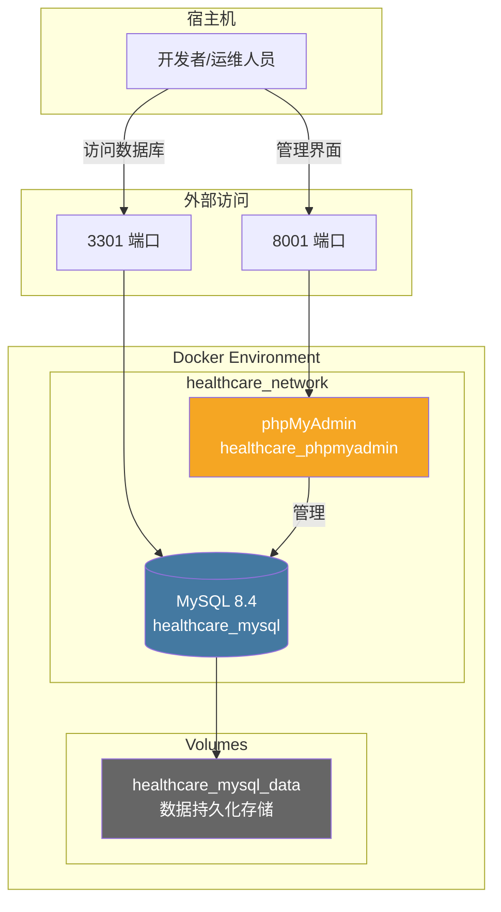
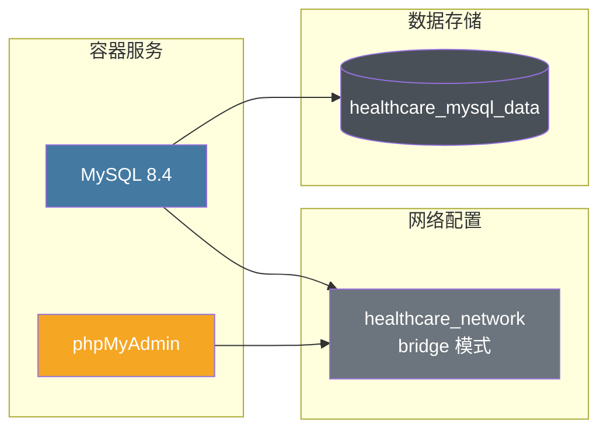
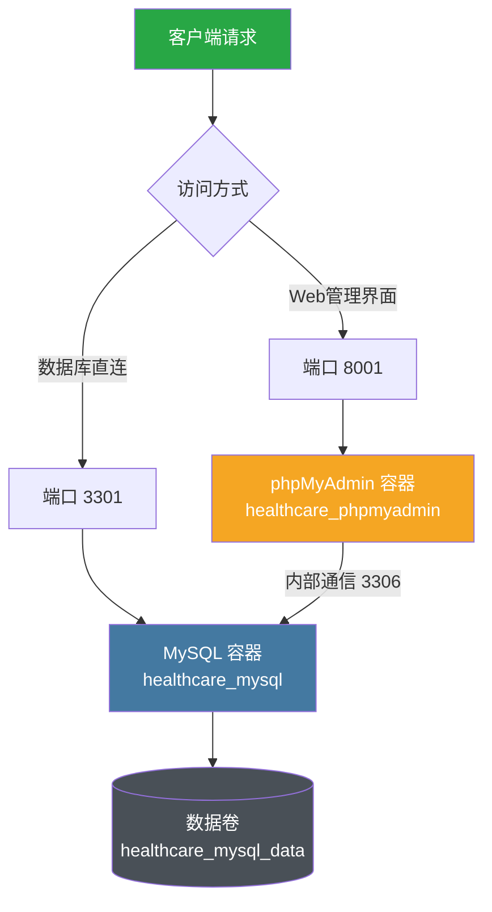
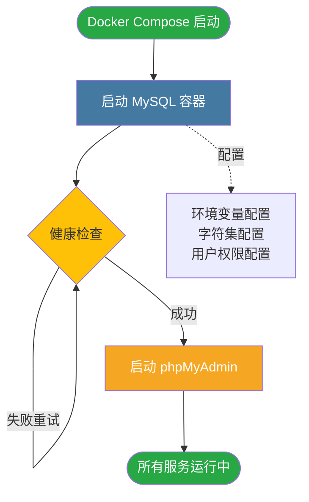
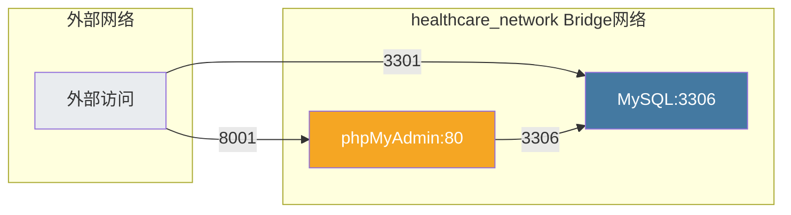
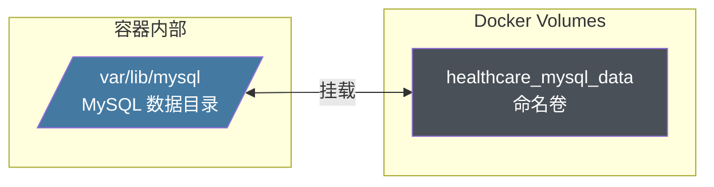

# QA Service User 部署文档

## 概述

本文档描述 QA Service User 服务的部署架构和配置。该服务作为医疗问答系统的用户管理模块，与 MySQL 数据库和 phpMyAdmin 管理工具协同工作。

## 部署架构图



## 服务组件架构



## 数据流向图



## 容器依赖关系



## 服务配置详情

### MySQL 数据库服务

| 配置项 | 值 | 说明 |
|--------|-----|------|
| 镜像 | mysql:8.4 | MySQL 8.4 官方镜像 |
| 容器名 | healthcare_mysql | 数据库容器标识 |
| 端口映射 | 3301:3306 | 宿主机 3301 映射到容器 3306 |
| 数据库 | healthcare | 主数据库名称 |
| 用户 | user | 应用访问用户 |
| 密码 | healthcare123 | 应用用户密码 |
| Root 密码 | root123 | 超级管理员密码 |

**字符集配置**：
- 字符集：utf8mb4
- 排序规则：utf8mb4_unicode_ci
- 初始化连接：SET NAMES utf8mb4

**健康检查**：
- 检查命令：mysqladmin ping
- 检查间隔：10 秒
- 超时时间：5 秒
- 重试次数：5 次

### phpMyAdmin 管理服务

| 配置项 | 值 | 说明 |
|--------|-----|------|
| 镜像 | phpmyadmin:latest | phpMyAdmin 最新镜像 |
| 容器名 | healthcare_phpmyadmin | 管理工具容器标识 |
| 端口映射 | 8001:80 | 宿主机 8001 映射到容器 80 |
| PMA 主机 | mysql | 连接的 MySQL 服务名 |
| PMA 端口 | 3306 | MySQL 内部端口 |

**访问地址**：http://localhost:8001

## 网络架构



**网络配置**：
- 网络名称：healthcare_network
- 网络模式：bridge
- 驱动类型：local

## 数据持久化



**数据卷配置**：
- 卷名称：healthcare_mysql_data
- 驱动：local
- 挂载点：/var/lib/mysql
- 生命周期：独立于容器，数据持久保存

## 部署步骤

### 前置条件

1. 已安装 Docker Engine (20.10+)
2. 已安装 Docker Compose (2.0+)
3. 确保端口 3301、8001 未被占用

### 快速部署

```bash
# 进入项目根目录
cd qa-live-healthcare-0322

# 启动所有服务
docker-compose up -d

# 查看服务状态
docker-compose ps

# 查看日志
docker-compose logs -f
```

### 分步部署


```bash
# 步骤 1: 拉取镜像
docker-compose pull

# 步骤 2-6: 启动服务（自动处理依赖）
docker-compose up -d

# 步骤 7: 验证服务
docker-compose ps
curl http://localhost:8001
```

## 服务管理

### 启动服务

```bash
# 启动所有服务
docker-compose start

# 启动单个服务
docker-compose start mysql
docker-compose start phpmyadmin
```

### 停止服务

```bash
# 停止所有服务
docker-compose stop

# 停止并删除容器
docker-compose down

# 停止并删除容器及数据卷（危险操作）
docker-compose down -v
```

### 重启服务

```bash
# 重启所有服务
docker-compose restart

# 重启单个服务
docker-compose restart mysql
```

### 查看状态

```bash
# 查看服务状态
docker-compose ps

# 查看资源使用
docker stats healthcare_mysql healthcare_phpmyadmin

# 查看日志
docker-compose logs -f --tail=100
```

## 访问指南

### MySQL 数据库连接

**命令行连接**：
```bash
# 使用本地客户端
mysql -h 127.0.0.1 -P 3301 -u user -phealthcare123 healthcare

# 使用 Docker 容器连接
docker exec -it healthcare_mysql mysql -u user -phealthcare123 healthcare
```

**应用配置连接**：
```properties
spring.datasource.url=jdbc:mysql://localhost:3301/healthcare?useSSL=false&serverTimezone=UTC&characterEncoding=utf8mb4
spring.datasource.username=user
spring.datasource.password=healthcare123
```

### phpMyAdmin 访问

**访问地址**：http://localhost:8001

**登录凭据**：
- 服务器：mysql
- 用户名：user
- 密码：healthcare123

或使用 root 账户：
- 用户名：root
- 密码：root123

## 安全建议

### 生产环境配置

1. **修改默认密码**：
   ```yaml
   environment:
     MYSQL_ROOT_PASSWORD: <强密码>
     MYSQL_PASSWORD: <强密码>
   ```

2. **限制端口暴露**：
   ```yaml
   ports:
     - "127.0.0.1:3301:3306"  # 仅本地访问
   ```

3. **使用环境变量文件**：
   ```bash
   # 创建 .env 文件
   MYSQL_ROOT_PASSWORD=your_secure_password
   MYSQL_PASSWORD=your_app_password
   ```

4. **配置防火墙规则**：
   ```bash
   # 仅允许特定 IP 访问
   ufw allow from <trusted_ip> to any port 3301
   ufw allow from <trusted_ip> to any port 8001
   ```

## 监控与维护

### 健康检查

```bash
# MySQL 健康检查
docker exec healthcare_mysql mysqladmin ping -h localhost -uroot -proot123

# 查看容器健康状态
docker inspect --format='{{.State.Health.Status}}' healthcare_mysql
```

### 数据备份

```bash
# 备份单个数据库
docker exec healthcare_mysql mysqldump -u user -phealthcare123 healthcare > backup_$(date +%Y%m%d).sql

# 备份所有数据库
docker exec healthcare_mysql mysqldump -uroot -proot123 --all-databases > all_backup_$(date +%Y%m%d).sql
```

### 数据恢复

```bash
# 恢复数据库
docker exec -i healthcare_mysql mysql -u user -phealthcare123 healthcare < backup_20250323.sql
```

### 日志管理

```bash
# 查看实时日志
docker-compose logs -f

# 导出日志到文件
docker-compose logs > docker_logs_$(date +%Y%m%d).log
```

## 故障排查

### 常见问题

1. **端口占用**
   ```bash
   # 检查端口占用
   netstat -tulpn | grep -E '3301|8001'
   
   # 解决方案：停止占用服务或修改端口映射
   ```

2. **容器无法启动**
   ```bash
   # 查看详细错误信息
   docker-compose logs mysql
   docker-compose logs phpmyadmin
   
   # 检查容器状态
   docker ps -a
   ```

3. **数据卷问题**
   ```bash
   # 查看数据卷
   docker volume ls
   
   # 检查数据卷详情
   docker volume inspect healthcare_mysql_data
   ```

4. **网络连接问题**
   ```bash
   # 检查网络
   docker network ls
   docker network inspect healthcare_network
   ```

## 扩展配置

### 添加应用服务

可在 docker-compose.yml 中添加 qa-service-user 应用服务：

```yaml
services:
  app:
    build: ./server/qa-service-user
    container_name: healthcare_app
    depends_on:
      mysql:
        condition: service_healthy
    environment:
      SPRING_DATASOURCE_URL: jdbc:mysql://mysql:3306/healthcare
      SPRING_DATASOURCE_USERNAME: user
      SPRING_DATASOURCE_PASSWORD: healthcare123
    ports:
      - "8080:8080"
    networks:
      - healthcare_network
```

### 多环境配置

```bash
# 开发环境
docker-compose -f docker-compose.yml -f docker-compose.dev.yml up -d

# 生产环境
docker-compose -f docker-compose.yml -f docker-compose.prod.yml up -d
```

## 附录

### 相关文档

- [API 接口文档](api.md)
- [项目结构文档](project-structure.md)
- [数据模型文档](data-models.md)
- [编码规范](coding-style.md)

